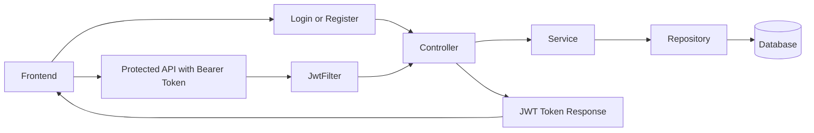
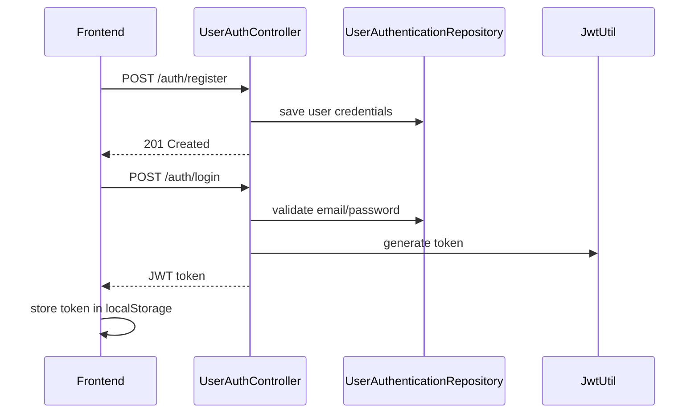

# Spring Boot User Management with JWT Authentication

This project is a full-stack application built to practice how a real backend is structured using Spring Boot.

The main goal of the project was to understand and implement:

- layered backend architecture
- authentication and authorization
- JWT token generation and validation
- CRUD APIs
- Spring Dependency Injection
- database access using JPA repositories
- frontend and backend integration

The backend is the main focus of the project, and the frontend is a simple client used to interact with the APIs.

## What This Project Does

The application allows a user to:

- register with email and password
- log in and receive a JWT token
- access protected APIs using that token
- create, view, and delete user records

This project was designed to demonstrate how authentication and CRUD operations work together inside a Spring Boot application.

## Tech Stack

- Java 21
- Spring Boot
- Spring Security
- Spring Data JPA
- MySQL / TiDB
- HTML, CSS, JavaScript

## How The Project Is Structured

The backend follows a layered structure:

- `Controller`
  Receives HTTP requests and returns responses.

- `Service`
  Contains business logic and sits between controller and repository.

- `Repository`
  Handles database operations using Spring Data JPA.

- `Entity / POJO`
  Represents the database tables as Java classes.

- `Security Layer`
  Handles login security, JWT validation, and route protection.

This separation makes the project easier to understand, maintain, and scale.

## Main Backend Components

### `UserController`

Handles user-related APIs such as:

- getting all users
- getting a user by ID
- creating users
- deleting users
- pagination and helper endpoints

This controller shows how Spring maps HTTP methods like `GET`, `POST`, and `DELETE` to Java methods.

### `UserAuthController`

Handles authentication APIs:

- register
- login

This is where:

- passwords are encoded
- credentials are validated
- JWT tokens are generated

### `ToDoService`

This service acts as the business layer for user-related operations.

It shows how service classes can:

- call repositories
- separate business logic from controllers
- keep the code organized

### `UserRepository`

This is the JPA repository for the `User` entity.

It handles:

- saving users
- fetching users
- deleting users
- pagination support

### `UserAuthenticationRepository`

This repository is used for authentication data stored in `UserAuth`.

It is mainly used to:

- find a user by email
- support login
- prevent duplicate registration

### `SecurityConfig`

This class configures Spring Security for the project.

It defines:

- which routes are public
- which routes require authentication
- password encoding
- stateless security
- CORS configuration
- JWT filter integration

### `JwtFilter`

This filter checks every protected request.

It:

- reads the bearer token from the request
- validates the token
- extracts the email from the token
- tells Spring Security that the request is authenticated

### `JwtUtil`

This utility class is responsible for:

- generating JWT tokens
- validating tokens
- extracting user information from tokens

## Request Flow

This flow shows the basic idea of the project:

1. the frontend sends a request
2. the controller receives it
3. the service processes business logic
4. the repository talks to the database
5. authentication is handled through JWT tokens and Spring Security

## Authentication Flow

This part of the project helped demonstrate:

- password hashing
- login validation
- token-based authentication
- how protected APIs work in a stateless backend

## Main APIs

### Authentication APIs

- `POST /auth/register`
- `POST /auth/login`

### User APIs

- `GET /api/users`
- `GET /api/users/{id}`
- `POST /api/users`
- `POST /api/users/createServicelevelEntry`
- `DELETE /api/users/{id}`

## Frontend

The frontend is intentionally simple and is mainly used to test and demonstrate the backend.

It includes:

- `login.html` for login
- `register.html` for registration
- `todos.html` as the authenticated user page
- `script.js` for API calls and token handling
- `style.css` for styling

The frontend:

- sends login and register requests
- stores the JWT token in `localStorage`
- sends the token in the `Authorization` header
- calls the protected user APIs

## What I Learned Through This Project

This project helped me understand:

- how Spring Boot applications are layered
- how controllers, services, and repositories work together
- how dependency injection reduces tight coupling
- how Spring Security protects routes
- how JWT authentication works end to end
- how to connect a frontend to protected backend APIs
- how CRUD operations are implemented in a structured backend

## Running the Project

### Backend

1. Configure the database in `application.properties`
2. Run the Spring Boot application
3. Backend starts on `http://localhost:8080`

### Frontend

1. Open the frontend HTML files in a browser
2. Register a user
3. Log in
4. Use the UI to access the protected APIs

## Notes

- `/auth/**` routes are public
- `/api/**` routes require a valid JWT token
- passwords are hashed using Spring Security
- token validation is handled by a custom JWT filter

